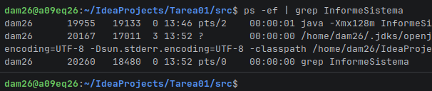

PID: 11321 PPID: 8155

PID: 19284 PPID:19133
* ¿Porque cambia el ppid?
El ppid refleja la identidad de donde se esta lanzando ese programa por eso en el terminal sale un numero y en terminal del intellij sale otro.
* Con el comando:

Cambia el PID: de 19284 a 19955

* Ejecutadlo después con java -Xmx128m InformeSistema y comparad las cuatro cifras de
  memoria con las de la ejecución normal. Indicad cuáles cambian, cuáles no y por qué.
  
  
  
  Cambia el PID: de 19284 a 19955 cambia porque porque se asignan de manera dinámica cada vez que un programa o tarea inicia en el sistema operativo, y al cerrarse, ese número queda libre y se reutiliza o se incrementa para los nuevos procesos 
* qué ruta generaría en el otro sistema operativo, explicando de dónde sale la diferencia.

La diferencia se debe a que el código no escribe la ruta a mano (hardcoded), sino que la construye dinámicamente consultando dos propiedades del sistema Java

# 3 Qué tipo de programación encaja
